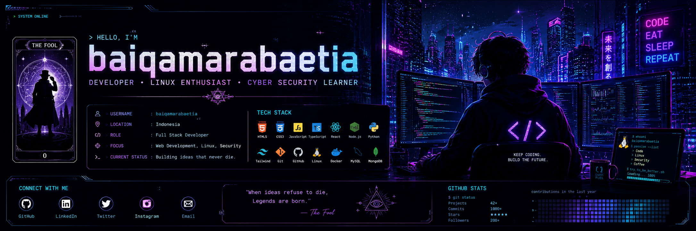

<p align="center">
  
</p>
<div align="center">

# 🃏 baiqamarabaetia

### 『 The Archivist of the Gray Mist 』


</div>

---

# 🌫️ The Gray Mist

```yaml
Name      : baiqamarabaetia
Alias     : The Archivist
Country   : Indonesia
Role      : Full Stack Developer
Focus     : Linux • Cyber Security • AI • Open Source
Status    : Building the impossible...
```

---

# 📜 Philosophy

> "Knowledge belongs to those who dare to seek it."

> "When Ideas Refuse To Die."

---

# ⚜️ Current Pathway

🃏 Full Stack Development

🐧 Linux

🛡 Cyber Security

🤖 Artificial Intelligence

📚 Open Source

---

# ⚡ Tech Arsenal

<p align="center">


</p>

---

# 📊 GitHub Statistics

<p align="center">


</p>

<p align="center">


</p>

---


# 📂 Featured Projects

🃏 Gray-Mist

📜 Forbidden-Library

🛡 Security-Lab

🐧 Linux-Scripts

🤖 AI-Archive

⚙️ DevVault

---

# 🎯 Current Mission

🔥 Become an Expert Full Stack Developer

🛡 Master Ethical Hacking

🐧 Master Linux

🤖 Build AI Applications

🌍 Contribute to Open Source

---

# 🕯️ Quote

> "The gray fog hides countless mysteries. Every line of code reveals another."

---

<div align="center">

### 🌌 End of Record

*"Walk through the gray mist, pursue knowledge, and never stop building."*

</div>
## 🐍 Contribution Snake

<p align="center">
  
</p>

## 🏆 GitHub Trophies

<p align="center">

</p>

## 📈 Contribution Graph

<p align="center">

</p>

<p align="center">

</p>

## 📊 GitHub Analytics

<p align="center">


</p>

